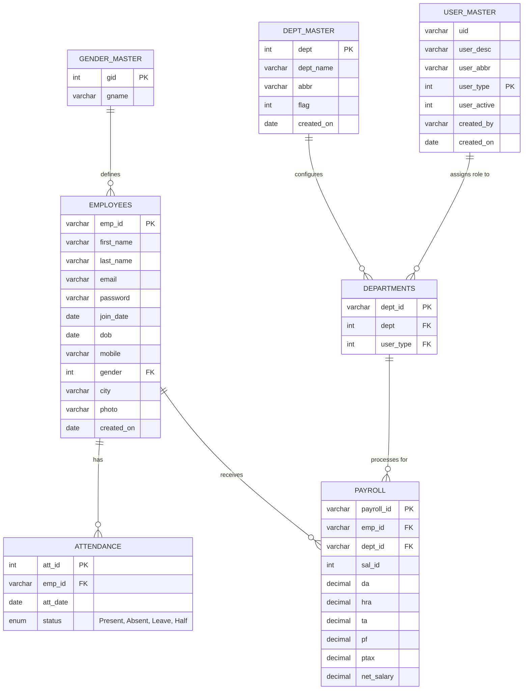
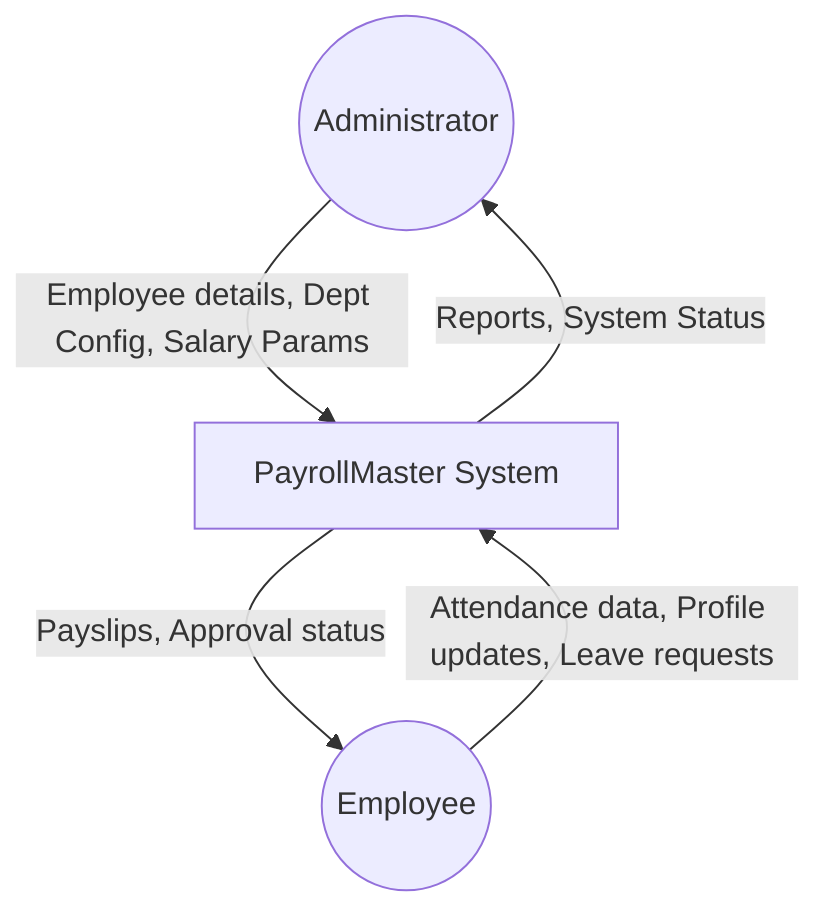
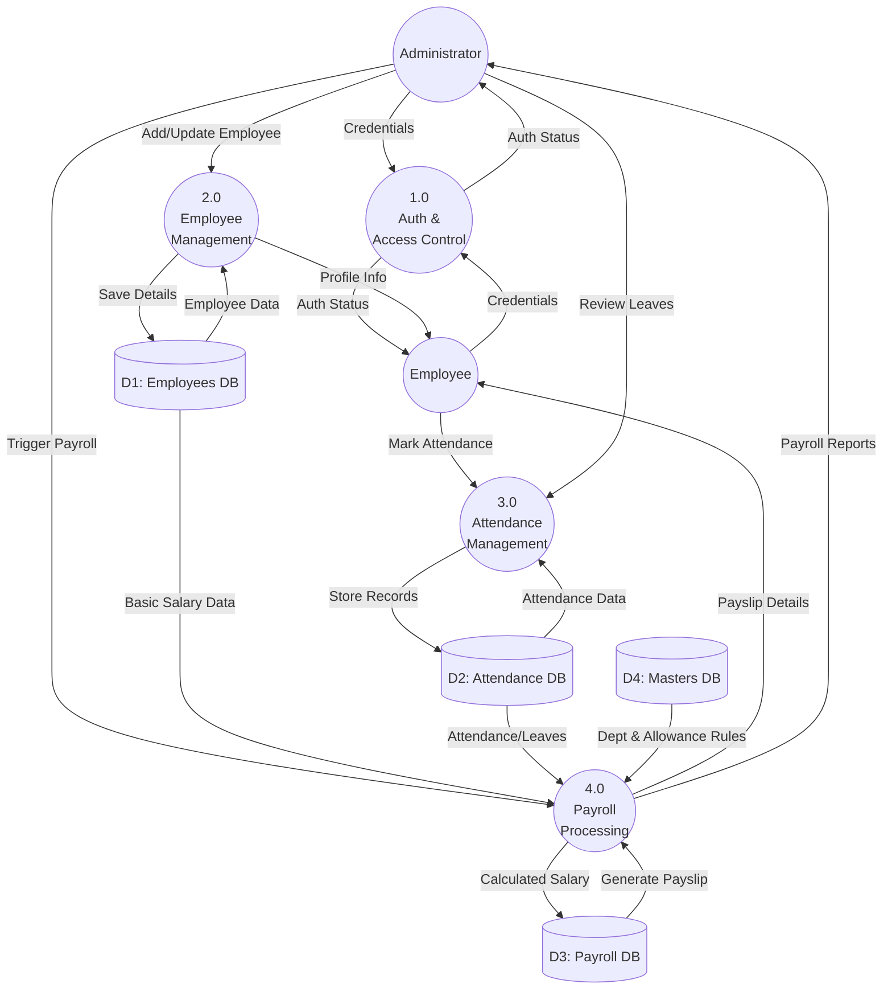

# faceRecognization
simple education project to validate user by face recognization during login
# PayrollMaster - Modern HR & Payroll

## 📖 Introduction Proposal
The modern enterprise relies on efficient handling of employee data, time-tracking, and remuneration. Manual HR processes using paper forms and disconnected spreadsheets often lead to errors, delays, and a lack of transparency. **PayrollMaster** is proposed as a centralized web-based HR and Payroll Management ecosystem designed to automate these workflows. It provides a secure, single point of truth for employee master data, leave approvals, attendance tracking, and one-click payroll generation via an intuitive dashboard. 

## ❗ Problem Statement
Traditional human resource departments struggle with fragmented data management. Tracking daily attendance manually, calculating half-days or leave deductions, and accurately processing payroll at the end of the month are tedious and prone to human error. There is a pressing need for a unified system that minimizes administrative overhead, eliminates payroll calculation errors, and empowers employees with self-service capabilities.

## 🎯 Project Scope
The scope of **PayrollMaster** includes:
- Secure role-based access for Administrators, HR Managers, and Employees.
- A centralized database for recording and retrieving employee master records and department allocations.
- A daily attendance module capable of handling different statuses (Present, Absent, Leave, Half-day).
- An automated payroll engine that computes net salary based on basic pay, allowances (DA, HRA, TA), and deductions (PF, Professional Tax) in conjunction with the attendance logs.
- Reporting dashboards for data analytics and financial tracking.

## 🚀 Features
- **Employee Onboarding:** Easily manage departments, designations, and employee records with secure self-service portals.
- **Attendance & Leaves:** Track daily presence, handle half-days, and approve or reject leave applications seamlessly.
- **1-Click Payroll:** Automatically calculate net salaries based on basic pay, unpaid leaves, and daily attendance.
- **Data Analytics:** Gain insights into your workforce with intuitive dashboards.
- **Financial Tracking:** Keep track of your payroll expenses securely.
- **Team Management:** Promote collaboration and easy management of enterprise teams.

## 💻 Software Used
- **Backend:** PHP (v8.x recommended)
- **Frontend:** HTML5, CSS3, Vanilla JavaScript
- **Database:** Relational Database (MySQL/MariaDB)
- **Web Server:** Apache (via XAMPP/WAMP)

## 📊 Case Study
**TechNova Solutions** (a mid-sized IT enterprise) recently adopted PayrollMaster to streamline their HR operations. Before implementation, their HR team spent up to 5 days a month reconciling attendance sheets and calculating payroll manually for 200 employees, facing a 4% error rate in salary disbursements. 
After deploying PayrollMaster, the payroll processing time was reduced to under 4 hours. The automated "1-Click Payroll" completely eliminated calculation errors, and the employee self-service portal reduced HR inquiries by 60%, allowing the HR team to focus on talent development rather than administrative paperwork.

## ⚙️ Implementation
The implementation of PayrollMaster follows a phased approach:
1. **Requirement Analysis:** Understanding the company's specific allowance structures and leave policies.
2. **Environment Setup:** Preparing the local or cloud hosting environment and configuring the SQL database.
3. **Data Migration:** Importing existing employee master data into the system.
4. **Training:** Conducting workshops for the HR team and providing user manuals for the employees.
5. **Go-Live:** Running a parallel trial for one payroll cycle before fully transitioning to the automated system.

## 🌍 Deployment
1. Clone or download this repository.
2. Place the `emplyeePayroll` folder in your local web server directory (e.g., `htdocs` for XAMPP or `var/www/html` for Apache).
3. Create a new MySQL database named `emp_payroll` and import the database from the `db/` folder (`emp_payroll.sql`).
4. Update your database credentials in the relevant PHP connection files (located in the `php/` folder).
5. Open your browser and navigate to `http://localhost/emplyeePayroll/index.php`.
6. For cloud deployment (e.g., AWS, Heroku, or cPanel), ensure that the PHP environment is configured correctly and the database connection strings reflect your cloud database host.

## 🛡️ Security
Designed for enterprise use, PayrollMaster ensures secure data handling, fast performance, and reliable employee management.

## 📄 License
&copy; 2026 PayrollMaster. All rights reserved.

---

## 🗄️ Database Table Structures

### 1. `employees`
| Column Name | Data Type | Key/Constraint | Description |
|---|---|---|---|
| emp_id | varchar(50) | Primary Key | Unique ID for the employee |
| first_name | varchar(50) | Not Null | Employee's first name |
| last_name | varchar(50) | Not Null | Employee's last name |
| email | varchar(100) | Not Null | Employee's email address |
| password | varchar(255) | Not Null | Hashed password |
| join_date | date | Not Null | Date of joining |
| dob | date | Not Null | Date of birth |
| mobile | varchar(10) | Not Null | Mobile number |
| gender | int(11) | Foreign Key | References gender_master |
| city | varchar(30) | Nullable | City of residence |
| photo | varchar(225)| Nullable | Profile photo path |
| created_on | date | Not Null | Record creation date |

### 2. `attendance`
| Column Name | Data Type | Key/Constraint | Description |
|---|---|---|---|
| att_id | int(11) | Primary Key | Unique attendance record ID |
| emp_id | varchar(50) | Foreign Key | References employees |
| att_date | date | Not Null | Date of attendance |
| status | enum | Not Null | Present, Absent, Leave, or Half |

### 3. `payroll`
| Column Name | Data Type | Key/Constraint | Description |
|---|---|---|---|
| payroll_id | varchar(30) | Primary Key | Unique payroll record ID |
| emp_id | varchar(50) | Foreign Key | References employees |
| dept_id | varchar(30) | Foreign Key | References departments |
| sal_id | int(11) | Not Null | Salary component ID |
| da | decimal(10,2)| Not Null | Dearness Allowance |
| hra | decimal(10,2)| Not Null | House Rent Allowance |
| ta | decimal(10,2)| Not Null | Transport Allowance |
| pf | decimal(10,2)| Not Null | Provident Fund deduction |
| ptax | decimal(10,2)| Not Null | Professional Tax deduction |
| net_salary | decimal(10,2)| Not Null | Final calculated salary |

### 4. `departments`
| Column Name | Data Type | Key/Constraint | Description |
|---|---|---|---|
| dept_id | varchar(30) | Primary Key | Unique mapping ID |
| dept | int(11) | Foreign Key | References dept_master |
| user_type | int(11) | Foreign Key | References user_master |

### 5. `dept_master`
| Column Name | Data Type | Key/Constraint | Description |
|---|---|---|---|
| dept | int(11) | Primary Key | Unique department ID |
| dept_name | varchar(50) | Not Null | Full name of the department |
| abbr | varchar(30) | Not Null | Abbreviation (e.g., IT, HR) |
| flag | int(11) | Not Null | Active/Inactive flag |
| created_on | date | Not Null | Record creation date |

### 6. `gender_master`
| Column Name | Data Type | Key/Constraint | Description |
|---|---|---|---|
| gid | int(11) | Primary Key | Unique gender ID (1,2,3) |
| gname | varchar(20) | Not Null | Gender name (Male, Female, Others) |

### 7. `user_master`
| Column Name | Data Type | Key/Constraint | Description |
|---|---|---|---|
| uid | varchar(10) | Nullable | User ID |
| user_desc | varchar(25) | Not Null | Description of the user role |
| user_abbr | varchar(10) | Not Null | Role abbreviation |
| user_type | int(11) | Primary Key | Numeric ID for the user role |
| user_active | int(11) | Not Null | Active/Inactive status |
| created_by | varchar(10) | Not Null | Creator's ID |
| created_on | date | Not Null | Record creation date |

---

## 📋 Software Requirements Specification (SRS)

### 1. Introduction
#### 1.1 Purpose
The purpose of this document is to outline the software requirements for **PayrollMaster**, a web-based HR and Payroll Management System. It provides an overview of the system's capabilities, target users, and technical constraints.
#### 1.2 Scope
PayrollMaster is designed to automate the manual HR workflows of modern enterprises. Its core scope includes employee onboarding, attendance tracking, leave management, and automated one-click payroll generation based on customizable parameters (DA, HRA, TA, PF, etc.).
#### 1.3 Overview
The system is built using PHP for the backend, HTML/CSS/JavaScript for the frontend, and a relational SQL database. It offers distinct portals and features tailored to administrators, HR managers, and employees.

### 2. Overall Description
#### 2.1 Product Perspective
PayrollMaster operates as a standalone web application. It uses a centralized MySQL database to maintain data integrity across multiple modules (Attendance, Payroll, Departments, Employees).
#### 2.2 Product Functions
- **Authentication & Authorization**: Secure login for employees, HR, and Admins. Role-based access control.
- **Employee Management**: Adding, updating, and viewing employee profiles (personal details, department, joining date).
- **Attendance & Leaves**: Recording daily attendance (Present, Absent, Leave, Half-day).
- **Payroll Processing**: Automated calculation of Net Salary based on basic pay, allowances (DA, HRA, TA), deductions (PF, Professional Tax), and attendance records.
- **Department Management**: Categorizing employees into predefined departments (IT, HR, R&D, etc.).
#### 2.3 User Classes and Characteristics
- **Admin**: Has full access to the system. Can manage all employees, process payroll, and generate reports.
- **HR Manager**: Can manage employee records, approve leaves, and oversee attendance.
- **Employee**: Can view their own profile, mark attendance, apply for leaves, and download payslips.

### 3. Specific Requirements
#### 3.1 Functional Requirements
- **FR1:** The system shall allow the Admin to create and update department details.
- **FR2:** The system shall allow secure registration and profile management of employees.
- **FR3:** The system shall support recording daily attendance status.
- **FR4:** The system shall calculate the Net Salary automatically by computing: `Net Salary = Basic + DA + HRA + TA - PF - PTax`.
- **FR5:** The system shall restrict data access based on `user_type` defined in the User Master.
#### 3.2 Non-Functional Requirements
- **Security:** Passwords must be securely hashed. Session variables must be used to protect internal pages from unauthorized access.
- **Performance:** The payroll calculation for up to 1000 employees should be processed within 5 seconds.
- **Usability:** The web interface must be responsive (mobile-friendly) and provide intuitive navigation.
- **Reliability:** The system database must enforce referential integrity to prevent orphan records.

---

## 🗺️ Entity-Relationship Diagram (ERD)

The following diagram illustrates the database schema and the relationships between the entities in the PayrollMaster system.

### Entity Descriptions
1. **EMPLOYEES**: Stores core information for staff members.
2. **ATTENDANCE**: Tracks daily presence, absence, and leaves for each employee.
3. **PAYROLL**: Holds the calculated salary components (DA, HRA, TA, PF, PTax) and final net salary for employees.
4. **DEPARTMENTS**: Maps specific department allocations and roles.
5. **DEPT_MASTER**: The lookup table for standard department names (IT, HR, R&D, etc.).
6. **GENDER_MASTER**: Lookup table for genders (Male, Female, Others).
7. **USER_MASTER**: Defines the types of users (e.g., Admin, Employee) and their permissions.

---

## 🔄 Data Flow Diagram (DFD)

### Level 0 (Context Diagram)
The Context Diagram shows the system as a single high-level process interacting with external entities.

### Level 1 Data Flow Diagram
The Level 1 DFD breaks down the main system into detailed sub-processes and shows the interaction with specific data stores.

### Description of Data Stores
- **D1 (Employees DB):** Refers to the `employees` table holding personal and contact information.
- **D2 (Attendance DB):** Refers to the `attendance` table keeping daily logs.
- **D3 (Payroll DB):** Refers to the `payroll` table calculating DA, HRA, TA, PF, PTax, and Net Salary.
- **D4 (Masters DB):** Refers to `dept_master`, `gender_master`, and `user_master` configuration tables.

